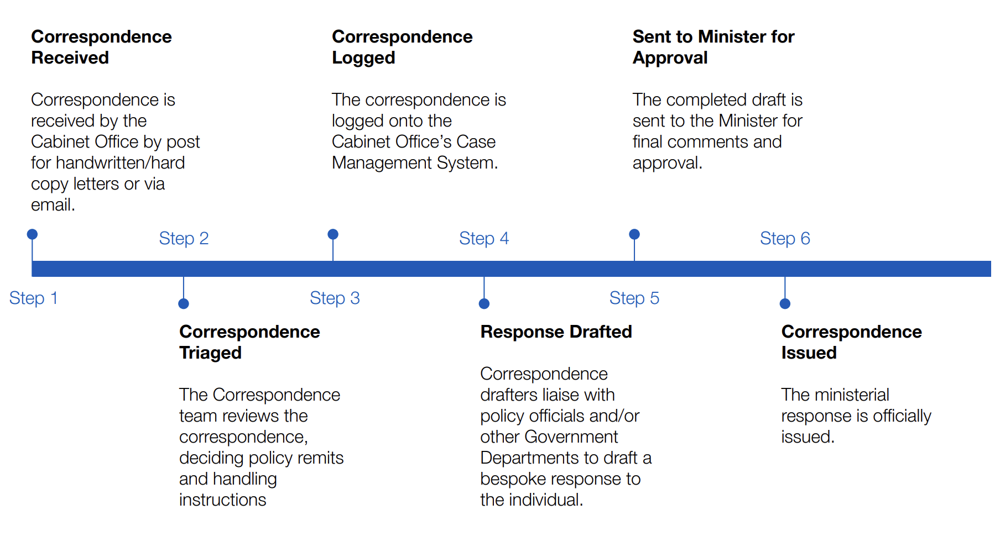

# Ministerial Dispatch Automation System (MiDAS)

## MINISTERIAL CORRESPONDENCE:

Streamlining and optimising the correspondence process generally, not just handwritten documents.

## Transformation process:
- Transcribe (hard copies take longer)
- Summarise accurately for the minister and intermediaries. 
- Triage: identify key components: Who responds? Generate probabilities based on text who needs to respond.
    - Which ministerial portfolio does each letter sit within?
- Drafting: Policy team = experts, they generate bespoke responses. The draft would be used by them.
    - Each minister has unique preferences for responding to correspondence.
- Response max is 2 pages of A4, font size 12. 

## Dataset:
- 1970 (more handwritten) and modern.
- Title, key term, summary, date, recommendation on how to respond to each of the documents.
- e.g. Royal Medal Recipient - they have data on how respond.
- Summary on the entire dataset (patterns, trends based on the paramters you're evaluating)
    - Constellation plot on each of the properties; experiment with different visualiation methods, which will allow:
        - Who needs to respond?
        - 

## Questions
1. Are all correspondence formats responded to in the same way or would different formats get different responses? - All same responses, yes. 
2. Does every document need to be assigned to 1/25 departments or is it more fine grained? - Identify relevant department for every letter. Make that judgement call based on the datasets. - 25 departments, 30-50 areas
3. Of the 250k received every year, how many are duplicates? - Vague answer to this. They might bucket some and respond en masse.
4. How are handwritten correspondence processed at the moment? - Scan it through a printer. This isn't the real problem.

# Ideas

## Pain points:
Either ministers or correspondence team respond to the documents.

- Scanning process: is that the bottleneck? Where are our vectors for exploration? - No, but add character recognition. 
- Triaging... to 25 departments, 30-50 areas. 
- Hierarchy of priority: Response time is really important for reputation and can be brought up during PMQs. 

## Two routes:
1. Reduce the number of low quality correspondence being sent (feedback on documents before they're sent)
2. Improve the response time and processing after submission. - more on the money. 

- Plot each component on a graph - identify if the letters are broad or general.

Feedback on the document that drafts the response.

- Minister enters their general desireed response, and this fills out a document for them using language models.

## Build steps

Run a document through a framework - find the best ways of prompting and compressing their contents; what questions are most useful across the documents?

How can we triage the documents down a cascade of functions before prompting? These could be insightful inflection points in the pattern recognition hierarchy. 

# MAJOR PROJECTS:

